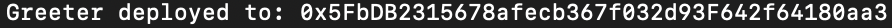

# React-Dapp-Boilerplate

## Overview
This template allows developers to quickly get started building an Ethereum decentralized application. 

## Prerequisites 
<ui>
  <li>Node</li>
  <li>HardHat</li>
  <li>MetaMask</li>
</ul> 

## Steps
1. Open Terminal
2. Clone repo 
`git clone https://github.com/rgurbatri/react-dapp-boilerplate.git`
3. `cd` into `react-dapp-boilerplate` and install dependencies 
`npm install`
4. Compile the Application Binary Interface (ABI) 
`npx hardhat compile`
5. Import test account into MetaMask: [Setup MetaMask](#setup-metamask)
6. Deploy sample contract to local network 
`npx hardhat run scripts/sample-script.js --network localhost`
7. Copy generated contract address from previous step (everything after the colon)  
 

8. In the IDE, navigate to `src/App.js`
9. Replace <i>your-contract-address</i> with the address obtained from <b>Step 6</b> 
10. In the terminal, navigate to the root of the project and run: `npm start`
11. If startup is successful, you have created your first decentralized application

## Setup MetaMask
1. In the terminal run: `npx hardhat node` 
2. Copy the private key of account/address 0 (everything after the colon) 
3. Open Google Chrome and click on your MetaMask extension and login 
4. Click on the MetaMask extension 
5. Login to your account 
6. Click the avatar in the top right and click `Import Account` 
7. Paste your private key in the input field 
8. Click import 
9. Continue with step 6 in the [Steps](#steps) guide 